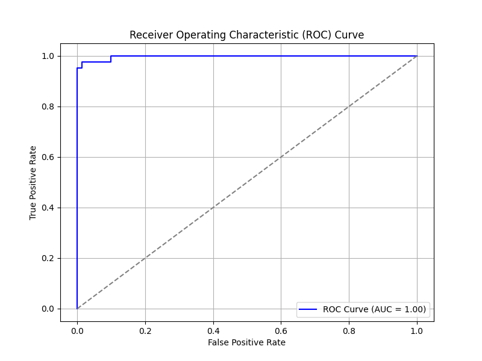
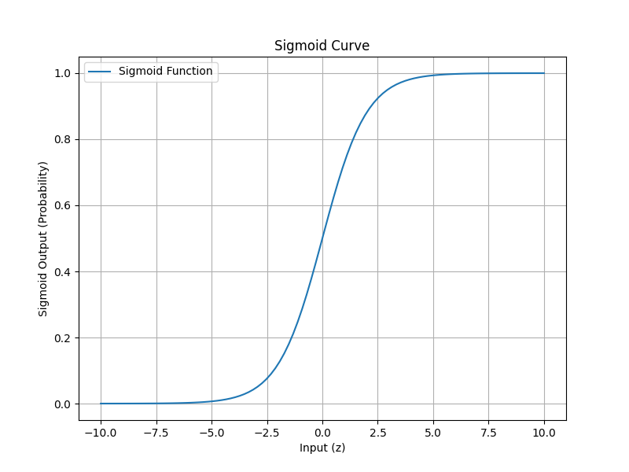

# Logistic Regression Binary Classifier

## Dataset
**Name:** Breast Cancer Wisconsin (Diagnostic) Dataset
**Source:** (https://www.kaggle.com/datasets/uciml/breast-cancer-wisconsin-data)

---

## Objective
Build a **binary classifier** using **Logistic Regression** to predict whether a tumor is **malignant (1)** or **benign (0)** based on medical features.

---

## Tools Used
- Python
- Scikit-learn
- Pandas
- Matplotlib
- NumPy
- VS Code

---

## Steps
### 1. Loaded and Preprocessed Data
- Removed unnecessary columns like `id` and `Unnamed: 32`
- Converted target labels to binary (M = 1, B = 0)

### 2. Train-Test Split
- 80% training, 20% testing using `train_test_split`

### 3. Standardized Features
- Used `StandardScaler` to normalize features

### 4. Trained Logistic Regression Model
- Trained a `LogisticRegression` model from `sklearn`

### 5. Evaluation (Default Threshold = 0.5)
- **Confusion Matrix:**
- **Accuracy:** 97.4%
- **Precision (Malignant):** 0.98  
- **Recall (Malignant):** 0.95  
- **ROC-AUC Score:** 0.997 — Excellent performance

### 6. Threshold Tuning (Threshold = 0.3)
- Made the model more sensitive to malignant cases
- **Confusion Matrix:**
- **Precision (Malignant):** 0.91  
- **Recall (Malignant):** 0.98

### 7. Sigmoid Function Explanation
- Plotted the **sigmoid curve**, which maps model output to probability (0 to 1)

---

## ROC Curve
AUC = **0.997**  
The ROC curve shows excellent separation between classes.

---
## Sigmoid Curve
The sigmoid function converts raw model output (logits) into probabilities between 0 and 1.

---

## Conclusion
This project demonstrates how to:
- Build a **binary classifier** using logistic regression
- Use **evaluation metrics**: confusion matrix, precision, recall, ROC-AUC
- **Tune decision thresholds**
- Understand the **sigmoid function** and its impact on classification

---